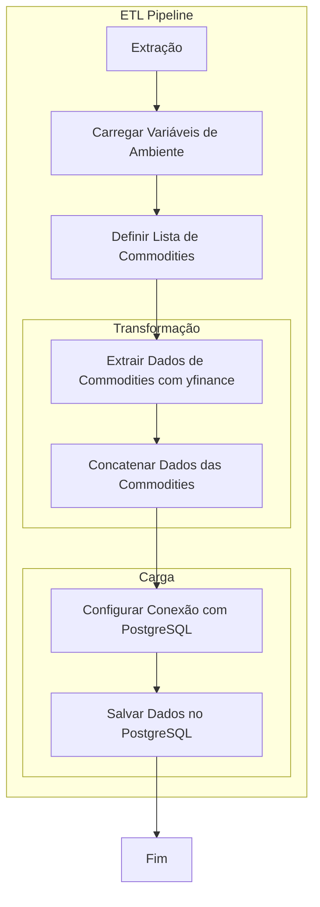
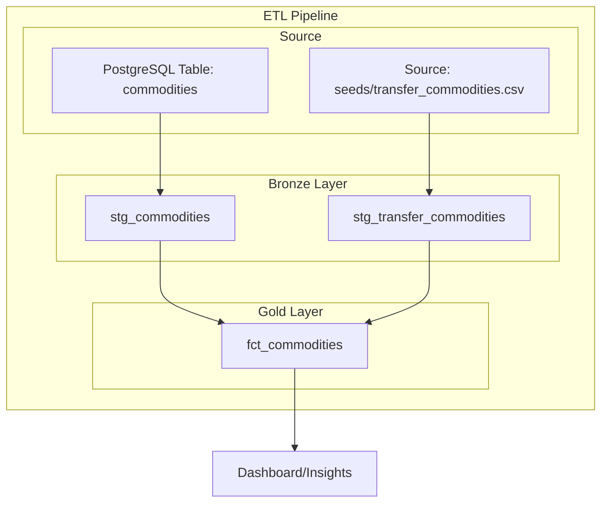
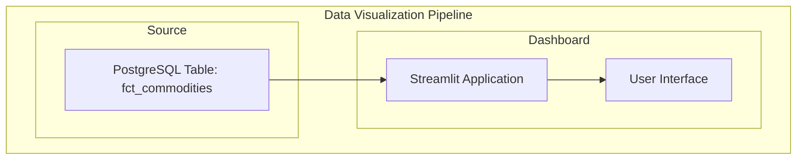

# Projeto de Data Warehouse

Este projeto demonstra a construção de um pipeline de dados completo, integrando tecnologias modernas para criar um Data Warehouse. O objetivo é processar dados de forma automatizada, estruturada e visualizá-los por meio de um dashboard.

## Tecnologias Utilizadas

- **Python**: Utilizado para a construção das etapas de extração e carga dos dados, e dashboard.
- **DBT-core**: Responsável pelas transformações e modelagem de dados no Data Warehouse com uso do SQL.
- **PostgreSQL**: Banco de dados usado como Data Warehouse, hospedado no Render.
- **Streamlit**: Framework utilizado para criar o dashboard interativo.

## Estrutura do Projeto

1. **Extração e Carga**: Scripts em Python conectam-se a fontes de dados externas, processam os dados e os carregam em tabelas brutas no PostgreSQL.

2. **Transformação**: Modelagem e limpeza de dados utilizando dbt-core para criar tabelas analíticas no Data Warehouse.

3. **Dashboard**: Disponibilização dos dados tratados e modelados através de um dashboard interativo criado com Streamlit.

## Fluxo do Pipeline
- **Extração e Carga**: Conexão com APIs e arquivo externo para extrair os dados e carregá-los no PostgreSQL.
- **Transformação**: Uso do dbt-core para criar modelos e transformações no Data Warehouse.
- **Dashboard**: Os dados transformados são exibidos em visualizações no Streamlit, permitindo análises dinâmicas.

---

## Como Executar
### Pré-requisitos

1. Python 3.8 ou superior.
2. PostgreSQL configurado e rodando.
3. Conta no Render para hospedar o banco de dados.
4. dbt-core instalado.
5. Dependências do Python listadas no arquivo `requirements.txt`.